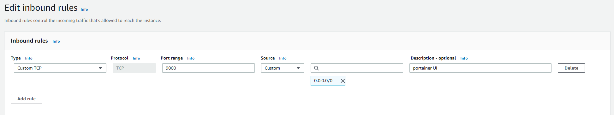

## Docker 

##### Manage docker container:

On AWS EC2, it's quite hard to manage docker images and containers because the only to interact is terminal.
We can use [Portainer](https://documentation.portainer.io) to access docker via http web UI

  * install Portainer on [linux](https://documentation.portainer.io/v2.0/deploy/ceinstalldocker/) 

  > docker volume create portainer_data
 
  > docker run -d -p 8000:8000 -p 9000:9000 --name=portainer --restart=always -v /var/run/docker.sock:/var/run/docker.sock -v portainer_data:/data portainer/portainer-ce

  * Add an inbound rule to allow TCP port 9000 in the instance security group.
  

## Database

##### DB manager:
* [dbeaver](https://dbeaver.io/)

## Media
#### Video
##### video editor:
* [handbrake](https://handbrake.fr/)
> HandBrake is a tool for converting video from nearly any format to a selection of modern, widely supported codecs.
* [icecreamapps](https://icecreamapps.com/Screen-Recorder/)
> Icecream Screen Recorder is an easy-to-use free screen recording software that enables you to record any area of your screen or save it as a screenshot.
#### Image
##### screenshot
* [Lightshot](https://app.prntscr.com/en/index.html)
> The fastest way to take a customizable screenshot
> 
## File Manager
*  [multcloud](https://www.multcloud.com/)
> Focus on Transferring across Clouds
